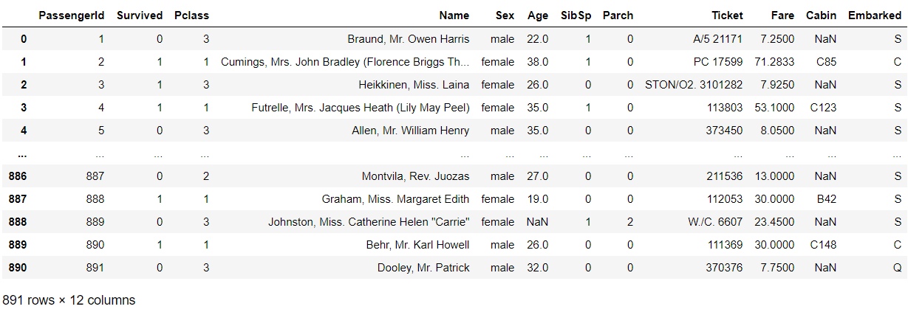
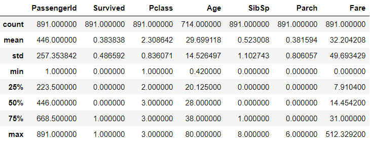
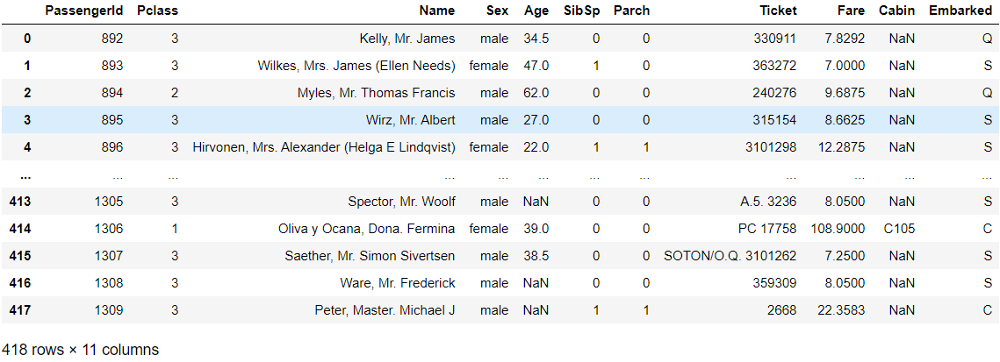
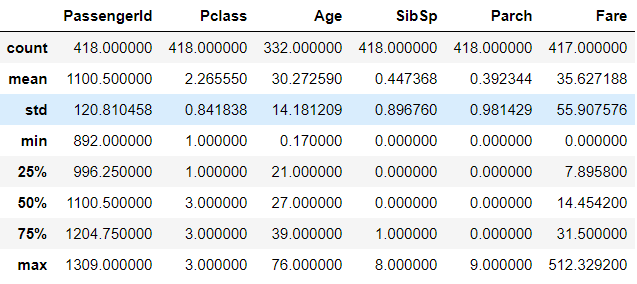
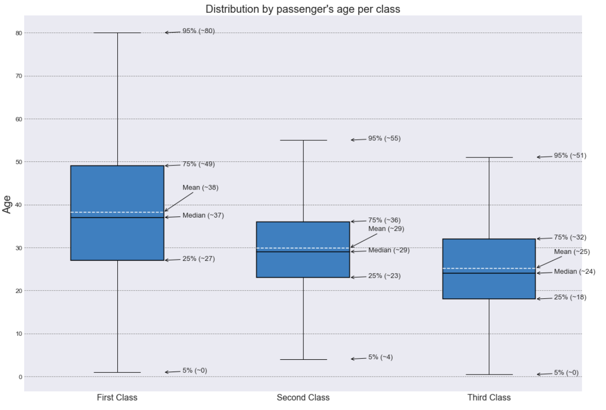
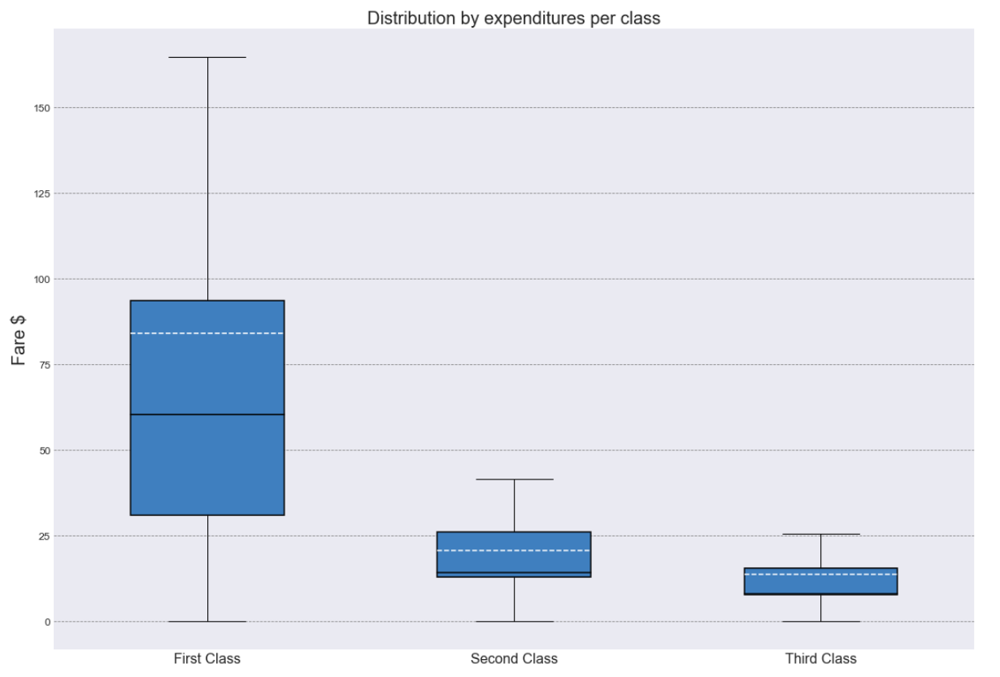
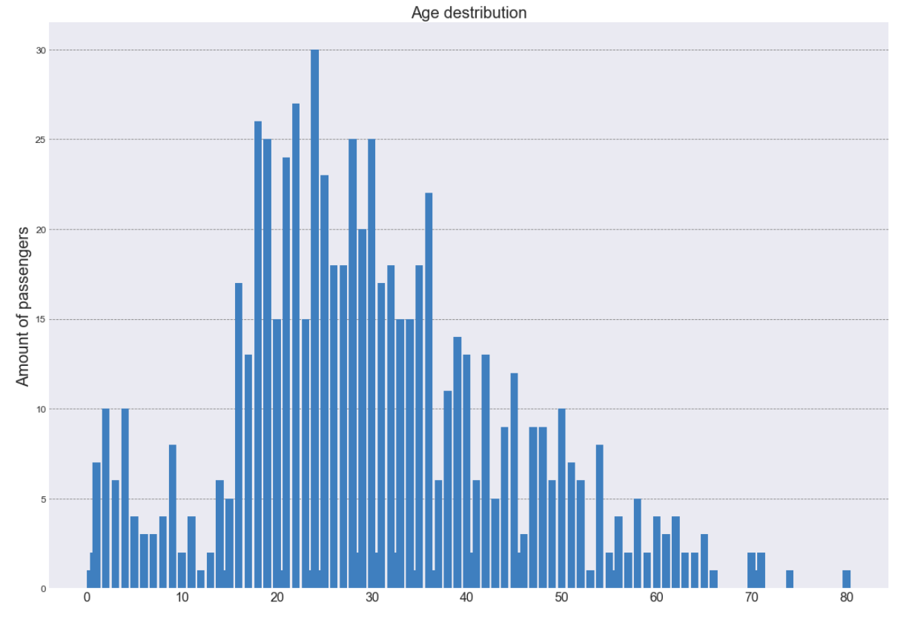
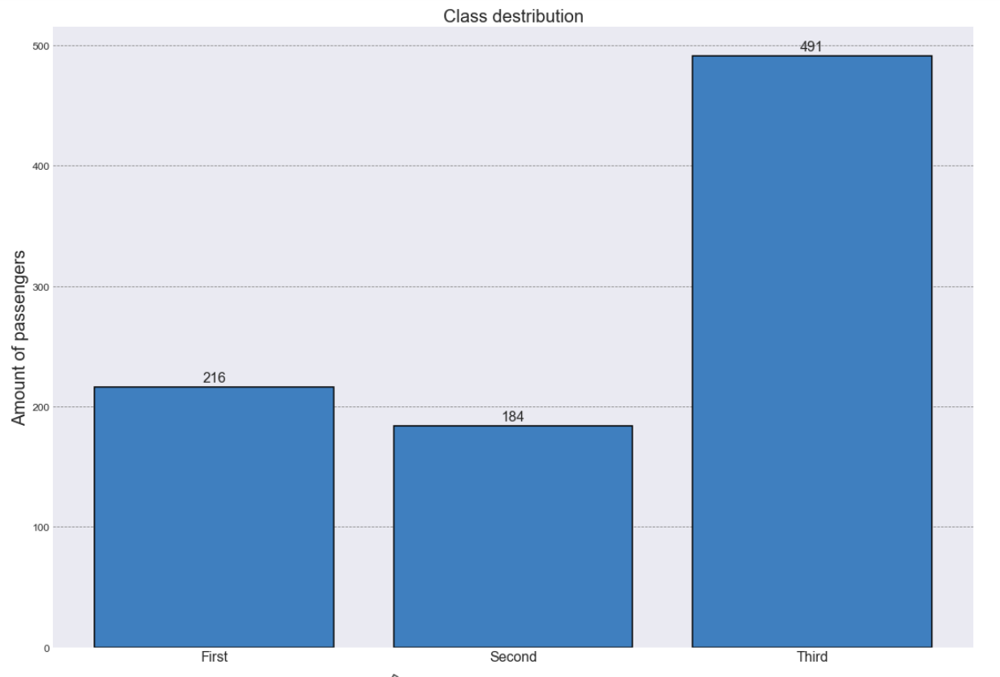
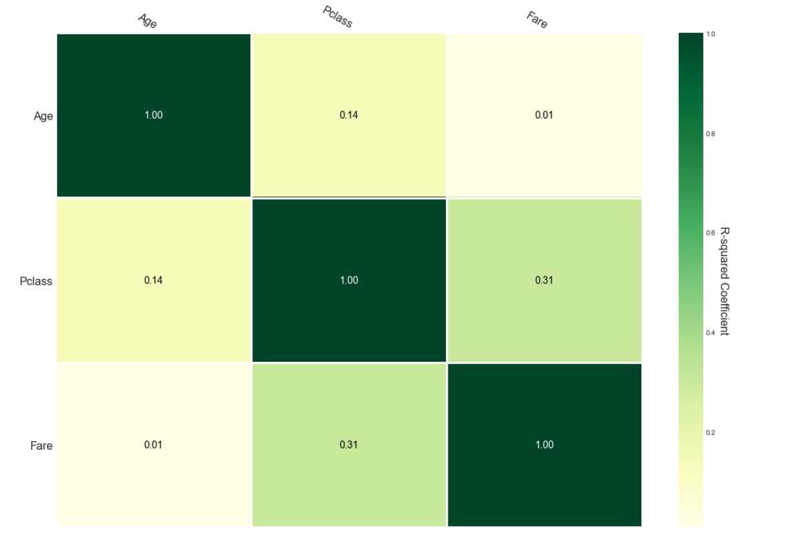
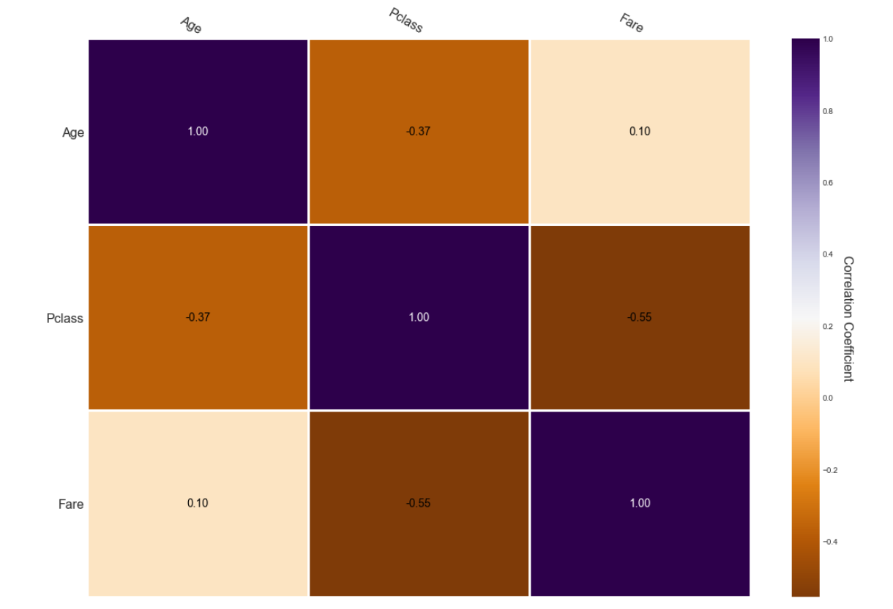

# Titanic: Machine Learning from Disaster

## Module Description

"<em>The sinking of the Titanic is one of the most infamous shipwrecks in history.

On April 15, 1912, during her maiden voyage, the widely considered “unsinkable” RMS Titanic sank after colliding with an iceberg. Unfortunately, there weren’t enough lifeboats for everyone onboard, resulting in the death of 1502 out of 2224 passengers and crew.

While there was some element of luck involved in surviving, it seems some groups of people were more likely to survive than others.

In this challenge, we ask you to build a predictive model that answers the question: “what sorts of people were more likely to survive?” using passenger data (ie name, age, gender, socio-economic class, etc).</em>"

## Define the problem

Before the digging into the task, let's define the problem and split it onto the smaller pieces (subtasks).

The main idea is to predict the survival of a passenger according to its features. Therefore we may relate the problem to the classification problem (binary one). There're  a bunch of different learning algorihms intended to solve such problems. However before we decide which one is better, we have to acsertain and prepare the data on which the algorithms will be learned. For the learning purposes the kaggle provided the *training* dataset and for the test the *testing* dataset. If we check the data, we may assume that the data is "raw" (it's not prepared for the learning, if we'ill try to fir the damp data to an algorithm, it will a really low accuracy). Consequently, the given data has to be prepared for the learning. Scaling, missing values, feature adding, etc.

**Pre-processing**

There are a lot of problems with data, for example:

* inconsistant values
* duplicate records
* missing values
* invalid data
* outlier
* non-scaled values

In our dataset we may notice some features with missing values. Here the ways to dispose of them:

* **Remove observation/records that have missing values.** But..

    * data may randomly missing, so by doing this we may lose a bunch of data
    * data may non-randomly missing, so by doing this we may also lose a bunch of data, again we're also introducing potential biases
    
* **Imputation**

    * replace missing values with another values
    * strategies: mean, median or highest frequency value of the given feature

## Table of Contents
- [Titanic: Machine Learning from Disaster](#titanic-machine-learning-from-disaster)
  - [Module Description](#module-description)
  - [Define the problem](#define-the-problem)
  - [Table of Contents](#table-of-contents)
  - [Extract Data](#extract-data)
  - [Solving missing data problem](#solving-missing-data-problem)
    - [Embarked NaN](#embarked-nan)
    - [Age NaN](#age-nan)

## Extract Data

For the first pass throughout the train data, we could grasp that:

1. Train data contains information about 891 passenger of the Titanic
2. To each passenger has been asigned an unique **PassengerId**
3. Did a passenger **Survived** (0 - no, 1 - yes)
4. In which class a pessanger placed (**Pclass**). There are the only three classes (1, 2, 3)
5. **Name** of each passenger. The name could be separated onto 3 parts: |Last name|Honorifics|First name|
6. **Sex** only the male and female are exists. (Yeeeeeeeees, nothing else, soleley 2 genders!!!!!)
7. **Age** age of a passenger. As we will see [further](#Solving-missing-data-problem) 20% is missing.
8. **SibSp** or Siblings/Spouses (Sisters, Brosers, Wifes, Husbands)
9. **Parch** parent-child
10. **Tiket** of a passenger
11. **Fare** - expenditures for the journey
12. A **Cabin** where a passenger has been placed. 77% missing.
13. **Embarked** a town from where a passenger sailed away. 2 fields are missing.

The test data contains 418 passengers. And omits the **Survived** column, which we shall to predict.

```python
data_train = pd.read_csv('train.csv')
data_test = pd.read_csv('test.csv')
```

**Train data:**




**Test data:**




## Solving missing data problem

In our Dataset appears such values as NaN (Not-a-Number). These occasions are distorting the dataset.
I could remove these fields if a scanty number of such field appeared in the Dataset. However as you can see below we have 687 NaN in the 'Cabin' column, and it is the 77% of entire dataset. Therefore I've decide to solve each NaN case.
<figure class="image" align="center">
<image src="imgs/md_miss_rat_train.png" align="center" title="Train missing values">

<figcaption>Training missing values</figcaption>
</figure>
<figure class="image" align="center">


<image src="imgs/md_miss_rat_test.png" align="center" title="Test missing values">
<figcaption>Test missing values</figcaption>
</figure>

### Embarked NaN

The smalest number of NaN ocassions in the 'Embarked' column. So let's solve it first.
I just found the information in the Google about two those and replaced NaN with figured data.
The [link](https://titanic.fandom.com/wiki/Martha_Evelyn_Stone) where information were found.
As it revealed Stone, Mrs. George Nelson (Martha Evelyn) and Icard, Miss. Amelie (the maid of the first one) are embarked from Southampton. Also, the same result could be extracted from the mean of the Embarked.

```python
data_train.at[data_train['PassengerId'] == 62, 'Embarked'] = 'S'
data_train.at[data_train['PassengerId'] == 830, 'Embarked'] = 'S'
```

### Age NaN

The next one NaN is the Age. I guess it is too irrational to Googl' the information about 177 passengers.
Therefor let's take a look at this statistically. First, I'd like to distinct columns which may explain somehow the Age.
* **First assumption:** "The age might depends on passenger's class. I mean, than maturer a man then a higher class he may afford."
* **Second assumption:** "The age might depends on fare. The ensue that than maturer a man then a larger amount may be paid."

In purpose to prove or rebut the assumtions above let's build the charts:

1. **First, Age/Pclass chart:**  According to the first plot, we see that
    - the first box chart encompasses the vastest spectrum of ages (0;80) the most common ages (25% - 75% data) lie within [27;49], 
    - the two remain classes are pretty akin by encompassed spectrum, I mean both contain the age distributed through 51 years (2'nd class - [4;55] most common range is [23;36]; 3'd class - [0;51] most common range is [18;32]). 
    
   Also, we might denote that in the every box a mean and connected median are sufficiently close to each other, which means that the age in the each class is smoothly distributed and approximately coincides to the normal distribution.
   
   
2. **Second, Fare/Pclass chart:** The second chart is the fare per class distribution. I would like to represent fare per age, however it shall not be significant, because other factors may influence. Corollary, I used the specific groups or passenger's class in other words. 
    - According the first box chart, we see that the first class incorporates the vastest range of the Fare (0;164) w/o outliers, however opposite to the Age/Pclass the mean is much further of the median, it is ensuing from the fact that the right whisker is the twice (x 2.3(6)) bigger than the left one, and outliers, where one of it is the 512. The whisker's length means that the range of "richest" passengers (without exceptions like 512, even so 512 influences to the mean) is twice extended than the range of the "poorest" ones. From this portrayal, we can assume that the income's range of the "poor" passengers is more narrower than "rich" ones. The note how did I get the coefficient 2.3(6): (164-93)/27
    - The second range of fare is much smaller than the first one, thus we may assume that the incomes of the 2'nd class passengers are much less than incomes of ~68% passengers of the 1'st class. According to its median which almost touch the Q1 - we could say that 45% of 2'nd class passengers afforded pretty large spectrum of price (14;41], in spite other 45% more narrow range (0;14], moreover 20% in this range lie within (10;14]. 
    - The last chart, which represents the third class shrank more than second class, with the 25%-50% range lies within 7 and 8, and 50%-95%  within 8 and 25. And the last thing, the passengers of the 3'd class poorer than 25% of the second one.

I'd like to make the intermediary assumption about passengers based on explored, so far.
I am pretty sure that a class defines a social class of a passenger (or if be more precise its incomes), because 68% of the 1'st class paid a higher price than each one from the 2'nd and 3'd classes. The same I could say regard the second class, I suppose that the second class consists of mid social class. (They weren't nobility, but they have money, because the 20% of expenditures lies within 26 - 41 pounds), whereas the 3'd class upper (95%) bound reaches 25 pounds. 

Also according to the Age per Class distribution I assume that a class may "explain" the age, but only the scanty part of it (about 10-15%). For example, sheer mature passengers who is older than 60 should be in the first class, etc.

   
3. **Third, Age destribution among passengers:** According to the diagram the most common age is approximately [18;32]. In only the 3'd class Q1-Q3 (50% of class' passengers) encompasses the whole spectrum, others merely incorparate solely a part of it.


4. **Forth, Passengers's destribution over the classes:** The ensue, which related to the previous statement. The most passengers were in the 3'd class.


5. **Fifth, Determination Coefficient between Age/Fare/Pclass:** At this moment I am pretty sure that neither fare and class don't explain the age (I mean they do, but a little bit). So, let's check the R^2 of these data. As we can see the fare explains only the 0.1% of the age, and Pclass explains 14% of age. Corollary, the Pclass may variate the age, but within a really small range, however it could be useful for the further NaN age filling.

6. **And the last chart, the correlation between Age/Fare/Pclass.** It shows that than higher class then maturer a passenger of its class. 









