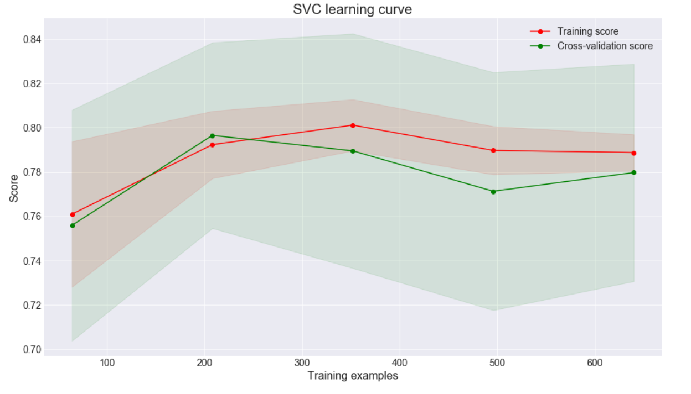

# Titanic: Machine Learning from Disaster

## Module Description

"<em>The sinking of the Titanic is one of the most infamous shipwrecks in history.

On April 15, 1912, during her maiden voyage, the widely considered “unsinkable” RMS Titanic sank after colliding with an iceberg. Unfortunately, there weren’t enough lifeboats for everyone onboard, resulting in the death of 1502 out of 2224 passengers and crew.

While there was some element of luck involved in surviving, it seems some groups of people were more likely to survive than others.

In this challenge, we ask you to build a predictive model that answers the question: “what sorts of people were more likely to survive?” using passenger data (ie name, age, gender, socio-economic class, etc).</em>"

## Define the problem

Before the digging into the task, let's define the problem and split it onto the smaller pieces (subtasks).

The main idea is to predict the survival of a passenger according to its features. Therefore we may relate the problem to the classification problem (binary one). There're  a bunch of different learning algorihms intended to solve such problems. However before we decide which one is better, we have to acsertain and prepare the data on which the algorithms will be learned. For the learning purposes the kaggle provided the *training* dataset and for the test the *testing* dataset. If we check the data, we may assume that the data is "raw" (it's not prepared for the learning, if we'ill try to fir the damp data to an algorithm, it will a really low accuracy). Consequently, the given data has to be prepared for the learning. Scaling, missing values, feature adding, etc.

**Pre-processing**

There are a lot of problems with data, for example:

* inconsistant values
* duplicate records
* missing values
* invalid data
* outlier
* non-scaled values

In our dataset we may notice some features with missing values. Here the ways to dispose of them:

* **Remove observation/records that have missing values.** But..

    * data may randomly missing, so by doing this we may lose a bunch of data
    * data may non-randomly missing, so by doing this we may also lose a bunch of data, again we're also introducing potential biases
    
* **Imputation**

    * replace missing values with another values
    * strategies: mean, median or highest frequency value of the given feature

## Table of Contents
- [Titanic: Machine Learning from Disaster](#titanic-machine-learning-from-disaster)
  - [Module Description](#module-description)
  - [Define the problem](#define-the-problem)
  - [Table of Contents](#table-of-contents)
  - [Extract Data](#extract-data)
  - [Solving missing data problem](#solving-missing-data-problem)
    - [Embarked NaN](#embarked-nan)
    - [Age NaN](#age-nan)
    - [Statistical Analysis](#statistical-analysis)
    - [Honorifics](#honorifics)
    - [Fare Zeros](#fare-zeros)
    - [Cabin NaN](#cabin-nan)
  - [Data Analysis](#data-analysis)
    - [Base dependecies](#base-dependecies)
    - [More complex dependencies](#more-complex-dependencies)
      - [A sex is influencing on the survival chances](#a-sex-is-influencing-on-the-survival-chances)
      - [Than Higher class then higher chance to survive](#than-higher-class-then-higher-chance-to-survive)
      - [Younger have more chances to survive rather than maturer](#younger-have-more-chances-to-survive-rather-than-maturer)
      - [Embarked affects to the survival](#embarked-affects-to-the-survival)
      - [Arbitrary Correlation Matrix](#arbitrary-correlation-matrix)
      - [Honorifics analysis](#honorifics-analysis)
      - [Distribution died and alive per sex and class](#distribution-died-and-alive-per-sex-and-class)
      - [Survival chances depends on family's presence](#survival-chances-depends-on-familys-presence)
      - [Family feature](#family-feature)
    - [Statistical Analysis 2](#statistical-analysis-2)
    - [Family presence feature](#family-presence-feature)
    - [Cabin again](#cabin-again)
  - [Recap of the survey](#recap-of-the-survey)
  - [Build models](#build-models)
    - [Hyperparameter Tuning](#hyperparameter-tuning)
    - [Plotting learning curves](#plotting-learning-curves)
  - [Submisson](#submisson)

## Extract Data

For the first pass throughout the train data, we could grasp that:

1. Train data contains information about 891 passenger of the Titanic
2. To each passenger has been asigned an unique **PassengerId**
3. Did a passenger **Survived** (0 - no, 1 - yes)
4. In which class a pessanger placed (**Pclass**). There are the only three classes (1, 2, 3)
5. **Name** of each passenger. The name could be separated onto 3 parts: |Last name|Honorifics|First name|
6. **Sex** only the male and female are exists. (Yeeeeeeeees, nothing else, soleley 2 genders!!!!!)
7. **Age** age of a passenger. As we will see [further](#Solving-missing-data-problem) 20% is missing.
8. **SibSp** or Siblings/Spouses (Sisters, Brosers, Wifes, Husbands)
9. **Parch** parent-child
10. **Tiket** of a passenger
11. **Fare** - expenditures for the journey
12. A **Cabin** where a passenger has been placed. 77% missing.
13. **Embarked** a town from where a passenger sailed away. 2 fields are missing.

The test data contains 418 passengers. And omits the **Survived** column, which we shall to predict.

```python
data_train = pd.read_csv('train.csv')
data_test = pd.read_csv('test.csv')
```

**Train data:**


**Test data:**


## Solving missing data problem

In our Dataset appears such values as NaN (Not-a-Number). These occasions are distorting the dataset.
I could remove these fields if a scanty number of such field appeared in the Dataset. However as you can see below we have 687 NaN in the 'Cabin' column, and it is the 77% of entire dataset. Therefore I've decide to solve each NaN case.
<figure class="image" align="center">
<image src="imgs/md_miss_rat_train.png" align="center" title="Train missing values">

<figcaption>Training missing values</figcaption>
</figure>
<figure class="image" align="center">


<image src="imgs/md_miss_rat_test.png" align="center" title="Test missing values">
<figcaption>Test missing values</figcaption>
</figure>

### Embarked NaN

The smalest number of NaN ocassions in the 'Embarked' column. So let's solve it first.
I just found the information in the Google about two those and replaced NaN with figured data.
The [link](https://titanic.fandom.com/wiki/Martha_Evelyn_Stone) where information were found.
As it revealed Stone, Mrs. George Nelson (Martha Evelyn) and Icard, Miss. Amelie (the maid of the first one) are embarked from Southampton. Also, the same result could be extracted from the mean of the Embarked.

```python
data_train.at[data_train['PassengerId'] == 62, 'Embarked'] = 'S'
data_train.at[data_train['PassengerId'] == 830, 'Embarked'] = 'S'
```

### Age NaN

The next one NaN is the Age. I guess it is too irrational to Googl' the information about 177 passengers.
Therefor let's take a look at this statistically. First, I'd like to distinct columns which may explain somehow the Age.
* **First assumption:** "The age might depends on passenger's class. I mean, than maturer a man then a higher class he may afford."
* **Second assumption:** "The age might depends on fare. The ensue that than maturer a man then a larger amount may be paid."

In purpose to prove or rebut the assumtions above let's build the charts:

1. **First, Age/Pclass chart:**  According to the first plot, we see that
    - the first box chart encompasses the vastest spectrum of ages (0;80) the most common ages (25% - 75% data) lie within [27;49], 
    - the two remain classes are pretty akin by encompassed spectrum, I mean both contain the age distributed through 51 years (2'nd class - [4;55] most common range is [23;36]; 3'd class - [0;51] most common range is [18;32]). 
    
   Also, we might denote that in the every box a mean and connected median are sufficiently close to each other, which means that the age in the each class is smoothly distributed and approximately coincides to the normal distribution.
   
   
2. **Second, Fare/Pclass chart:** The second chart is the fare per class distribution. I would like to represent fare per age, however it shall not be significant, because other factors may influence. Corollary, I used the specific groups or passenger's class in other words. 
    - According the first box chart, we see that the first class incorporates the vastest range of the Fare (0;164) w/o outliers, however opposite to the Age/Pclass the mean is much further of the median, it is ensuing from the fact that the right whisker is the twice (x 2.3(6)) bigger than the left one, and outliers, where one of it is the 512. The whisker's length means that the range of "richest" passengers (without exceptions like 512, even so 512 influences to the mean) is twice extended than the range of the "poorest" ones. From this portrayal, we can assume that the income's range of the "poor" passengers is more narrower than "rich" ones. The note how did I get the coefficient 2.3(6): (164-93)/27
    - The second range of fare is much smaller than the first one, thus we may assume that the incomes of the 2'nd class passengers are much less than incomes of ~68% passengers of the 1'st class. According to its median which almost touch the Q1 - we could say that 45% of 2'nd class passengers afforded pretty large spectrum of price (14;41], in spite other 45% more narrow range (0;14], moreover 20% in this range lie within (10;14]. 
    - The last chart, which represents the third class shrank more than second class, with the 25%-50% range lies within 7 and 8, and 50%-95%  within 8 and 25. And the last thing, the passengers of the 3'd class poorer than 25% of the second one.

I'd like to make the intermediary assumption about passengers based on explored, so far.
I am pretty sure that a class defines a social class of a passenger (or if be more precise its incomes), because 68% of the 1'st class paid a higher price than each one from the 2'nd and 3'd classes. The same I could say regard the second class, I suppose that the second class consists of mid social class. (They weren't nobility, but they have money, because the 20% of expenditures lies within 26 - 41 pounds), whereas the 3'd class upper (95%) bound reaches 25 pounds. 

Also according to the Age per Class distribution I assume that a class may "explain" the age, but only the scanty part of it (about 10-15%). For example, sheer mature passengers who is older than 60 should be in the first class, etc.

   
3. **Third, Age destribution among passengers:** According to the diagram the most common age is approximately [18;32]. In only the 3'd class Q1-Q3 (50% of class' passengers) encompasses the whole spectrum, others merely incorparate solely a part of it.


4. **Forth, Passengers's destribution over the classes:** The ensue, which related to the previous statement. The most passengers were in the 3'd class.


5. **Fifth, Determination Coefficient between Age/Fare/Pclass:** At this moment I am pretty sure that neither fare and class don't explain the age (I mean they do, but a little bit). So, let's check the R^2 of these data. As we can see the fare explains only the 0.1% of the age, and Pclass explains 14% of age. Corollary, the Pclass may variate the age, but within a really small range, however it could be useful for the further NaN age filling.

6. **And the last chart, the correlation between Age/Fare/Pclass.** It shows that than higher class then maturer a passenger of its class. 


### Statistical Analysis

I was conducting statistical analysis in purpose to prove these:

1. A class reflects a social class of a passenger.
2. The Fare doesn't explain the age
3. The class explains only the 1/7 of the age.

**№ 1**
This statement is true. To prove this I used [CLT](https://en.wikipedia.org/wiki/Central_limit_theorem).


**№ 2** This assumption is also true. To prove this I used this formula, and then via Linear Regression I calculated p-value. ([p-value calculating](https://stats.stackexchange.com/questions/352383/how-to-calculate-p-value-for-multivariate-linear-regression))


<image src="imgs/md_rsq.png" align="center" title="rsq">

**№ 3** Also true. The way of prove the same.

### Honorifics

As many others I've noticed the [honorifics](https://en.wikipedia.org/wiki/English_honorifics). "*In the English language, an honorific is a form of address indicating respect.*" We can split a name to the three parts: **[Last name, ]** **[Honorific. ]** **[First name]** and extract honorifics as I did so. I've decided to add the Honorifics as the feature to the dataset.

```python
data_train['Honorific'] = data_train['Name'].apply(lambda str: str.split(', ')[1].split('. ')[0].split(' ')[-1])
data_test['Honorific'] = data_test['Name'].apply(lambda str: str.split(', ')[1].split('. ')[0].split(' ')[-1])
```

**Train data**


Let's plot the Age per Honorific to see if there a dependencies among them.

As we may see below that the age somehow shifted, depends on the honorific. Therefore, the replacement by the mean in the each Honorific's subclass is more accurate than by the mean in the sex's (male/female) subclass or in the Pclass' subclass.

But, I added another method of the replacement (may be it's not the enhancement).
I assign each nan-age to the random value which lies within Confidence Interval  of the sample means, with Confidence Level 68%.

Let's note that the mean of the sample means is equal to the population mean.

<image src="imgs/md_mean.png" align="center">

and the sample means standard deviation is equal to the population standard deviation devided by root square of the sample size.

<image src="imgs/md_sigma.png" align="center">


According to the plot we maight assume that the difference between training and test data is barely seen.


Due to the [randit](https://numpy.org/doc/stable/reference/random/generated/numpy.random.randint.html) uses the uniform probability density function


i.e. there is equal chances for each value for both datasets within a CI. I'd like to define the better CI.

And fo these purposes I have to know the Z-score our test-dataset to our train-dataset, in purpose to aware are they differs a lot. And know what exactly CI I required. To estimate z-score for each one use the formula:


```python
def z_score_test_train(train, test):
    res = []
    tr_stat = honorific_stat_compound(train, train[train.Age.isna() == False])
    ts_stat = honorific_stat_compound(test, test[test.Age.isna() == False])
    for honor in ts_stat.index:
        if honor in tr_stat['Mean'] and not np.isnan(ts_stat['Mean'][honor]) and not np.isnan(tr_stat['Sigma'][honor]):
            res.append((ts_stat['Mean'][honor] - tr_stat['Mean'][honor])/(tr_stat['Sigma'][honor]/math.sqrt(calculate_sample_size(tr_stat['Amount'][honor]))))

    return sum(res)/len(res)
```
Z = 0.57. We can say that 1 standard deviation is enough to encompasses both datasets.

```python
for dataset in [data_train, data_test]:
    means, _, mean_sigma, _ = statistic_honor(data_train)
    for honor, std in mean_sigma.items():
        if dataset[dataset.Honorific == honor]["Age"].isnull().sum() > 0:
            mean = means[honor]
            null_num = dataset[dataset.Honorific == honor]["Age"].isnull().sum()
            rand_age = np.random.randint((mean - std), (mean + std), size = null_num) if (mean-std) < (mean + std) else mean
            age_slice = dataset[dataset.Honorific == honor]["Age"].copy()
            age_slice[np.isnan(age_slice)] = rand_age
            dataset.loc[dataset.Honorific == honor, 'Age'] = dataset[dataset.Honorific == honor]["Age"].fillna(age_slice)    
```
`statistic_honor(data_train)` - returns means, sample size, mean's sigma, honor's statistics for each honorific for every dataset.


Finally we solved the Age-NaN:) If you compare the mean and std of the Age current dataset and the [base dataset](#extract-data), you may notice that the difference is scanty (less than 1). Hence I suppose that the replacement has succeed.

### Fare Zeros

If we take a look at the Fare which is  lower than 6 pounds we may see that these Fare is not reliable (except 4.0125, because the lowest cost for the 3'd class was 2 pounds, according to the RUS wikipedia). We might see that the ratio of 0-Fare in the training dataset is the 2% of the entire dataset. Therefore if we replace these Fare to the mean of a passenger's class, it won't hurt somehow the dataset.

```python
data_train[data_train.Fare < 6]
```


As I said above the ratio of the 0-Fare to the entire dataset's shape is about 2%.

```python
data_train.groupby('Pclass')['Fare'].mean()
```
```
Pclass
1    84.154687
2    20.662183
3    13.675550
Name: Fare, dtype: float64
```

Replace 0-Fare values in both datasets, with the mean value of the correspondent class

```python
for dataset in [data_train, data_test]:

    m2 = dataset.Fare == 0
    
    avg = data_train.groupby('Pclass')['Fare'].mean()
    dataset.loc[m2, 'Fare'] = dataset.loc[m2, 'Pclass'].map(avg)
```
Take a look at means after replacement:
```python
data_train.groupby('Pclass')['Fare'].mean()
```
```
Pclass
1    86.478188
2    21.335950
3    13.786960
Name: Fare, dtype: float64
```
### Cabin NaN

The problem is that in the **Cabin** column, virtually 80% is missing. However I've noticed some features in the Cabin column.

1. **The first:** Each Cabin begins with a letter, which indicates a deck, for example A1234 says that a passenger's cabin was at the A deck.
2. **The second:** if the last digit of a number is odd then the Cabin placed at the port side of the liner, otherwise if even then at the starboard side.

However, as I said above this information doesn't matter, because we have only 1/5 of revealed data of entire dataset. Of course we may detect some dependencies, but the ratio is too little. Therefore I believe that it's not influence on model accuracy, somehow.

However, I've found out that on the body of the [Herbert Cave](https://www.encyclopedia-titanica.org/titanic-victim/herbert-cave.html) was found [partial listing of first class cabin accommodation](https://www.encyclopedia-titanica.org/cave-list.html). Therefore we may assume that the passengers with known number of Cabin which not belongs the first class have to be alive. However it will be observed [further](#Cabin-again). 

## Data Analysis

### Base dependecies

First, let's take a look to the base distributions. And make some assumptions.

1. **First:** amount of died bigger than survived.
2. **Second:** males more than females
3. **Third:** passengers of third class more than 2 remains
4. **Forth:** most common age [18; 35]
5. **Fifth:** prevalent number of passengers didn't have Parent/Chiled/Siblings on the liner
6. **Sixth:** prevalent number of passengers siled away from Southampton
7. **Seventh:** prevalent number of passengers paid the lowest price (what explains the most of passengers were in the 3'd class)

At this step we could say that the main features of a model are the sex (The captain ordered that the women and children have to be saved first) and the Cabin (where it was located).


### More complex dependencies

Let's contemplate what dependecies may be extracted. They may be hard to notice.

1. Ascertain whether a sex affects to the survival rate. **(It does)**
2. Does a class (Cabin location) affect to the survival rate. **(It does)**
3. Check if the age (as digit) affects to the survival rate. **(Seems like no, it doesn't)**

#### A sex is influencing on the survival chances

Check the assumption, that women have more chances to survive rather than mans. (Due to captain order)

***Assumption has confirmed. Women have higher survival rate.***


#### Than Higher class then higher chance to survive

Let's check the ratio of died to survived in each class.

***Along with the rank of class is rising, the ratio of survived passengers is increasing.***


#### Younger have more chances to survive rather than maturer

I supposed that if a human is younger he is stronger, hardier, etc. However the chart shows us that it doesn't really affect.

***The assumption that the age affects to survival rate is wrong. (When I say age I mean exactly age as a digit, not an age' group)*** 


#### Embarked affects to the survival

First chart shows that there are some dependecies between survival rate and embarked spot. However, as I gues it depends on class and the second chart clearly shows us that my assumption is proper.


#### Arbitrary Correlation Matrix

Let's take a brake and look at the correlation between the current features.

Summarize, the current assumption:

1. Our previous assumption, regard the [passenger's class](#Than-Higher-class-then-higher-chance-to-survive) (than higher a class then higher a chance to survive) and the [sex](#A-sex-is-influencing-on-the-survival-chances) (women have higher chances to survive, because of captain order) are confirmed.

2. The age, siblings and parent/child relationship make sheer low effect tot the survival rate.

3. We may noticed that Pclass really close connected to the fare (ha-ha, could  it be otherwise?), than higher class (3->1) then higher cost and vise versa. 

4. It seems like fare and embarked features do some effect, but I believe it is, due to the Pclass (embarked prove is [above](#Embarked-affects-to-the-survival)). From the sections above, we can ascertain that Pclass affects on survival rate (higher class - higher chances to survive) [1] and that the Pclass depends on fare (than higher fare then higher class' rank) [3]. By combining these two claims we might assume that than higher fare then higher chances to survive (exactly what the chart shows). This issue we will explore [further](#Honorifics-analysis)

5. Honorific, is pretty interesting feature, according to the chart the correlation between honorific and survival rate is negative (than higher honorific then lower chance to survive). However we get this $r$ coefficient with this arrangement of honorifics:

     * 0: 'Capt'
     * 1: 'Col'
     * 2: 'Countess'
     * 3: 'Don'
     * 4: 'Dr'
     * 5: 'Jonkheer'
     * 6: 'Lady'
     * 7: 'Major'
     * 8: 'Master'
     * 9: 'Miss'
     * 10: 'Mlle'
     * 11: 'Mme'
     * 12: 'Mr'
     * 13: 'Mrs'
     * 14: 'Ms'
     * 15: 'Rev'
     * 16: 'Sir'
   
   if we will swap the order then the coefficient become another. I soppuse we need to split this Honorifics onto the more common and discrete by each other groups. Also honorifics affects to the Age, but the issue how much it does still the same.
   
6. The assumption that the Age affects to the class rank is also true (on 30%), than maturer a passenger then higher rank of a class he can afford.

We may emphasize another dependencies, but I do not see a reason to write them down.

Due to the dataframe has non-numerical data, we need to convert it. I will drop the **PassengerId**, **Name**, **Ticket**, **Cabin** from the temporary dataset, because the do not affect directly (explicitly) to the model's accuracy.


#### Honorifics analysis

As I said before there are too many honorifics, and I believe it is required to split them onto groups.


I wanna to turn in a new parameter **"survival rate"** which represents a ratio of survived in a specific group.

```python
def survival_rate(data):
    return data[data.Survived == 1].shape[0]/data.shape[0]
```

From the chart below we grasp that the lowest survival rate at the mans. Women and children have higher chances to survive. 


#### Distribution died and alive per sex and class
Women, as we said many times before, have much higher chances to survive rather than mans. And in the 3'd class died women much more than in the 2'd and 1'st. The amount of died mans is much bigger than survived, however the difference between classes is scanty.  


#### Survival chances depends on family's presence

Than intense and vibrant color on the chart below then  more data at this point (x,y).

According to chart we may assume those passengers who have no parents/children and siblings have pretty equal chances to survive and die. Also those, who have a lot of children have much higher chances to die than survive.


#### Family feature

I wish to set the new parameter **Family** it includes the overall amount of relatives (Parent + children + brothers + sisters + husbands + wives + etc.). I'd like to determine some dependencies thro the Family's size.

Let's take a look at the portrayal of the family's effect to the survival rate. We might see that I've  wrong regarded the "equal chances" to survive/die for those who have no relatives (they survive in 30% of occurrences). Those who have 3 relatives have highest chances to survive. However we have to prove statistical significance of this values, because it's may be just an occasions, for instance, there are a few passengers with 3 relatives (and almost everybody survived), whereas those who have no relatives much prevail by their quantity.

Also we may say that the women with 0-3 relatives have the much higher chances to survive. But it is also required to prove the statical significance.

```python
data_train['Family'] = data_train['Parch'] + data_train['SibSp']
data_test['Family'] = data_test['Parch'] + data_test['SibSp']
```


### Statistical Analysis 2

Almost everywhere the Logistic Regression and Linear Regression are fitted. Therefore I used simple linear regression test instead of binary logistic regression test.

The base assumptions wich were established:

1. A honorific class affects to the survival
2. Family presence affects to the survival
3. Family presence at women affects to the survival

Note: I converted the data to numerical for the entire section.

**№1 A honorific class affects to the survival:** Using statistical analysis I observe, that the honorific's class affects to the survival (a little bit)

**№2 Family presence affects to the survival:** Using statistical analysis I observed, that the number of relatives doesn't affect to the survival.

**№3 Family presence at women affects to the survival:** Using statistical analysis I observed, that women's kins prsence does affect to the survival.

### Family presence feature

I am baffling thro the two last hypthesis testing above. Where one says that the number of kins is nothing for the survival, in spite the second shows that for women relatives presence is affect somehow to the survival. I decided to turn in another parameter **hasFamily** - binary parameter which shows, has a passenger family or not.

```python
data_train['hasFamily'] = data_train['Family'].apply(lambda x: 1 if x > 0 else 0)
data_test['hasFamily'] = data_test['Family'].apply(lambda x: 1 if x > 0 else 0)
```

According to the chart below we can assume that those passengers who have family get the higher chances to survive. However, the chances for both (have/haven't family) for women of the 1'st and 2'nd class are pretty equal. For the women of the 3'd class the rule: has family ==> higher chances to survive doesn't work.


### Cabin again

Do you still remember what we've [figured out](#Cabin-NaN)? Ok, ok, I will recall. We ascertain that on the body of the Herbert Cave was found partial listing of first class cabin accommodation. Thus we assumed that, thos passengers in dataset who have a Cabin number, and it not belongs to the first class - therefore these passengers are alive.  

According to the two charts below we can say that we were right. 

***Those who have Cabin's number, especially the mans of the 2'nd and 3'd classes have higher chances to survive.***

```python
data_train['NotNanCabin'] = data_train['Cabin'].apply(lambda x: 0 if x != x else 1)
data_test['NotNanCabin'] = data_test['Cabin'].apply(lambda x: 0 if x != x else 1)
```


## Recap of the survey

Let's summarize everything we explored.

1. We've proved that a class reflects the social class of a passenger, however it isn't crucial for the Survival.
2. Also extracted and proved that the Age depends on Pclass (at 14%)
3. Added up new feature's variables: HonCl, hasFamily, NotNanCabin
4. Those variables which were removed, are statistically insignificant

**New variables**

1. **hasFamily** - the indicator, if a passenger has family
2. **HonCl** - Honorific Class (Nobility, Miss, Mrs, Master, Mr)
3. **NotNanCabin** - the variable responsible for indicating is the ***Cabin*** variable is NaN.

There are some features which don't (do a really small) affect to the survival rate. Firstly, I'd like to check how good the performance is with all features, then I will drop **Age**, **HonCL**, **Family** to ascertain how good it is.


## Build models

The goal of the model's building is how accurate does it predict did a specific passenger survive or not. Therefore a prediction has to be binary (0 - did not survive; 1 - survived). So, for this purpose we'ill use the algorithms specified for the classification. Further, we'ill take them apart.

Though, we have the test dataset provided by Kaggle, we have to split the train data onto train and test datasets, before we will apply a model to the test dataset by Kaggle. Splitting, according to the rule 80/20 

```python
X_train, X_test, y_train, y_test = train_test_split(data_train.drop('Survived', axis=1), data_train['Survived'], train_size = 0.8, random_state = 20)
```

We use the ROC and AUC metrics for the model evaluation. And in purpose to proper evaluate a model we will use the K-folds with and 10 folds.

```python
K_fold = StratifiedKFold(n_splits=10)
```

Let's choose 10 most popular Classificators.

* KNN
* AdaBoost
* Decision Tree
* Random Forest
* Extra Trees
* Support Vector Machine
* Gradient Boosting
* Logistic regression
* Linear Discriminant Analysis
* Multiple layer perceprton

```python
rs = 2
base_models = []
cross_validation_res = []
cross_validation_mean = []
cross_validation_std = []

base_models.append(KNeighborsClassifier())
base_models.append(AdaBoostClassifier(DecisionTreeClassifier(random_state=rs),random_state=2,learning_rate=0.1))
base_models.append(DecisionTreeClassifier(random_state=rs))
base_models.append(RandomForestClassifier(random_state=rs))
base_models.append(ExtraTreesClassifier(random_state=rs))
base_models.append(SVC(random_state=rs))
base_models.append(GradientBoostingClassifier(random_state=rs))
base_models.append(LogisticRegression(random_state = rs))
base_models.append(LinearDiscriminantAnalysis())
base_models.append(MLPClassifier(random_state=rs))
```
```python
for model in base_models :
    cross_validation_res.append(cross_val_score(model, X_train, y_train, scoring="roc_auc", cv=K_fold, n_jobs=4))
```
```python
for cv_result in cross_validation_res:
    cross_validation_mean.append(cv_result.mean())
    cross_validation_std.append(cv_result.std())

cross_validation_frame = pd.DataFrame(
    {
        "CrossValMeans": cross_validation_mean,
        "CrossValErrors": cross_validation_std,
        "Algorithms":[
                     "KNeighboors",
                     "AdaBoost", 
                     "DecisionTree",   
                     "RandomForest",
                     "ExtraTrees",
                     "SVC",
                     "GradBoosting",                      
                     "LogistRegr",
                     "LinDiscrAnal",
                     "MultiLayerPerc"]
    })
```


Now I wanna explore these Algorithms discretely:
* GBC Classifier
* Linear Discriminant Analysis
* Logistic Regression
* Random Forest Classifer
* Gaussian Naive Bayes
* Support Vectore Machine

**[Gradient Boosting](https://en.wikipedia.org/wiki/Gradient_boosting)**

**In:**
```python
gmc_model = GradientBoostingClassifier()

scores = cross_val_score(gmc_model, X_train, y_train, cv=K_fold,
                       n_jobs = 4, scoring = 'roc_auc')

round(np.mean(scores)*100, 2)
```
**Out:** 87.75


**[Linear Discriminant Analysis](https://en.wikipedia.org/wiki/Linear_discriminant_analysis#:~:text=Linear%20discriminant%20analysis%20(LDA)%2C,or%20separates%20two%20or%20more)**


**In:**
```python
lda_model= LinearDiscriminantAnalysis()

scores = cross_val_score(lda_model, X_train, y_train, cv=K_fold,
                       n_jobs=4, scoring='roc_auc')

round(np.mean(scores)*100, 2)
```
**Out:** 84.86

**[Logistic Regression](https://en.wikipedia.org/wiki/Logistic_regression)**


**In:**
```python
logit_model = LogisticRegression()
scores = cross_val_score(logit_model, X_train, y_train, cv=K_fold, 
                        n_jobs=4, scoring='roc_auc')

round(np.mean(scores)*100, 2)
```
**Out:** 84.87

**[Random Forest](https://en.wikipedia.org/wiki/Random_forest)**

**In:**
```python
rfc_model = RandomForestClassifier(n_estimators=10)
scores = cross_val_score(rfc_model, X_train, y_train, cv=K_fold, 
                        n_jobs=4, scoring='roc_auc')

round(np.mean(scores)*100, 2)
```
**Out:** 85.7

**[Gaussian Naive Bayes](https://en.wikipedia.org/wiki/Naive_Bayes_classifier)**

**In:**
```python
gnb_model = GaussianNB()

scores = cross_val_score(gnb_model, X_train, y_train, cv=K_fold, 
                        n_jobs=4, scoring='roc_auc')

round(np.mean(scores)*100, 2)
```
**Out:** 82.3

**[Support Vector Machine](https://en.wikipedia.org/wiki/Support_vector_machine)**

**In:**
```python
svm_model = SVC(C=1, gamma='scale', kernel='linear')

scores = cross_val_score(svm_model, X_train, y_train, cv=K_fold, 
                        n_jobs=4, scoring='roc_auc')

round(np.mean(scores)*100, 2)
```
**Out:** 84.03

### Hyperparameter Tuning

**In:**
```python
gbc = GradientBoostingClassifier()
gb_param_grid = {
              'loss' : ["deviance", "exponential"],
              'n_estimators' : [100, 200, 300],
              'learning_rate': [0.1, 0.05, 0.01, 0.001],
              'max_depth': [4, 8, 16],
              'min_samples_leaf': [100, 150, 250],
              'max_features': [None, 0.3, 0.1]
              }

gs_gbc = GridSearchCV(gbc, param_grid = gb_param_grid, cv=K_fold, 
                     scoring="roc_auc", n_jobs= 4, verbose = 2)

gs_gbc.fit(X_train, y_train)
gbc_best = gs_gbc.best_estimator_
gbc_best_params = gs_gbc.best_params_

gs_gbc.best_score_
```

**Out:**
```
Fitting 10 folds for each of 648 candidates, totalling 6480 fits
[Parallel(n_jobs=4)]: Using backend LokyBackend with 4 concurrent workers.
[Parallel(n_jobs=4)]: Done  58 tasks      | elapsed:    2.3s
[Parallel(n_jobs=4)]: Done 300 tasks      | elapsed:    9.0s
[Parallel(n_jobs=4)]: Done 706 tasks      | elapsed:   21.1s
[Parallel(n_jobs=4)]: Done 1272 tasks      | elapsed:   37.9s
[Parallel(n_jobs=4)]: Done 2002 tasks      | elapsed:  1.0min
[Parallel(n_jobs=4)]: Done 2892 tasks      | elapsed:  1.4min
[Parallel(n_jobs=4)]: Done 3946 tasks      | elapsed:  2.0min
[Parallel(n_jobs=4)]: Done 5160 tasks      | elapsed:  2.6min
[Parallel(n_jobs=4)]: Done 6480 out of 6480 | elapsed:  3.2min finished
0.8760333470362539
```
**In:**
```python
rfc = RandomForestClassifier()

rf_param_grid = {"max_depth": [None],
              "min_samples_split": [2, 6, 20],
              "min_samples_leaf": [1, 4, 16],
              "n_estimators" :[100, 200, 300, 400],
              "criterion": ["gini", "entropy"]}


gs_rfc = GridSearchCV(rfc, param_grid = rf_param_grid, cv=K_fold,
                     scoring="roc_auc", n_jobs= 4, verbose = 1)

gs_rfc.fit(X_train, y_train)
rfc_best = gs_rfc.best_estimator_
rfc_best_params = gs_rfc.best_params_

gs_rfc.best_score_
```

**Out:**
```
Fitting 10 folds for each of 72 candidates, totalling 720 fits
[Parallel(n_jobs=4)]: Using backend LokyBackend with 4 concurrent workers.
[Parallel(n_jobs=4)]: Done  42 tasks      | elapsed:    4.7s
[Parallel(n_jobs=4)]: Done 192 tasks      | elapsed:   21.1s
[Parallel(n_jobs=4)]: Done 442 tasks      | elapsed:   49.2s
[Parallel(n_jobs=4)]: Done 720 out of 720 | elapsed:  1.3min finished
0.888081954651722
```

**In:**
```python
logit = LogisticRegression()

lr_param_grid = {"penalty" : ["l2"],
              "tol" : [0.0001,0.0002,0.0003],
              "max_iter": [100,200,300],
              "C" :[0.01, 0.1, 1, 10, 100],
              "intercept_scaling": [1, 2, 3, 4],
              "solver":['liblinear', 'lbfgs'],
              "verbose":[1]}


gs_logit = GridSearchCV(logit, param_grid = lr_param_grid, cv=K_fold,
                     scoring="roc_auc", n_jobs= 4, verbose = 2)

gs_logit.fit(X_train, y_train)
logit_best = gs_logit.best_estimator_
logit_best_params = gs_logit.best_params_

gs_logit.best_score_
```

**Out:**
```
Fitting 10 folds for each of 360 candidates, totalling 3600 fits
[Parallel(n_jobs=4)]: Using backend LokyBackend with 4 concurrent workers.
[Parallel(n_jobs=4)]: Done 128 tasks      | elapsed:    0.6s
[Parallel(n_jobs=4)]: Done 1096 tasks      | elapsed:    5.2s
[Parallel(n_jobs=4)]: Done 2720 tasks      | elapsed:   16.2s
[LibLinear]
[Parallel(n_jobs=4)]: Done 3600 out of 3600 | elapsed:   22.1s finished
0.8502239308925356
```

**In:**
```python
lda = LinearDiscriminantAnalysis()

lda_param_grid = {"solver" : ["svd", "lsqr"],
              "tol" : [0.0001, 0.0002, 0.0003]}


gs_lda = GridSearchCV(lda, param_grid = lda_param_grid, cv=K_fold,
                     scoring="roc_auc", n_jobs= 4, verbose = 1)

gs_lda.fit(X_train, y_train)
lda_best = gs_lda.best_estimator_
lda_best_params = gs_lda.best_params_

gs_lda.best_score_
```

**Out:**
```
[Parallel(n_jobs=4)]: Using backend LokyBackend with 4 concurrent workers.
[Parallel(n_jobs=4)]: Done  53 out of  60 | elapsed:    0.1s remaining:    0.0s
Fitting 10 folds for each of 6 candidates, totalling 60 fits
[Parallel(n_jobs=4)]: Done  60 out of  60 | elapsed:    0.1s finished
0.8485890885600188
```

**In:**
```python
# Best params, previously checked: {'C': 200, 'gamma': 0.0001, 'kernel': 'linear'}

svm = SVC(probability=True, cache_size=7000)
svc_param_grid = {'kernel': ["linear", "rbf"], 
                  'gamma': [0.0001, 0.001, 0.01, 0.1, 1],
                  'C': [1, 10, 50, 100, 200, 300]}

gs_svm = GridSearchCV(svm, param_grid=svc_param_grid, cv=K_fold,
                      scoring="roc_auc", n_jobs=-1, verbose = 10)

gs_svm.fit(X_train, y_train)

svm_best = gs_svm.best_estimator_
svm_best_params = gs_svm.best_params_

# Best score 0.8487653388816179
gs_svm.best_score_
```
**Out:**


```python
best_classifiers = {
    'classifiers': [gbc_best, rfc_best, logit_best, lda_best, svm_best],
    'classifiers_names': [
        'Gradient Boosting', 
         'Random Forest',
         'Logistic Regression',
         'Linear Discriminant Analysis',
         'Support Vector Machine'
        ],
    'classifiers_colors': ['#3366E6', '#ff0088', '#00ffbf', '#00a310', '#ffcc00'],
    'classifiers_params': {
        'Gradient Boosting': gbc_best_params, 
        'Random Forest': rfc_best_params, 
        'Logistic Regession': logit_best_params, 
        'Linear Discriminant Analysis': lda_best_params, 
        'Support Vector Machine': svm_best_params
    }
}
```


```python
best_classifiers['classifiers_params']
```

```
{'Gradient Boosting': 
    {
        'learning_rate': 0.1,
        'loss': 'deviance',
        'max_depth': 4,
        'max_features': None,
        'min_samples_leaf': 100,
        'n_estimators': 300
    },
 'Random Forest': 
    {
        'criterion': 'gini',
        'max_depth': None,
        'min_samples_leaf': 4,
        'min_samples_split': 6,
        'n_estimators': 100
    },
 'Logistic Regession': 
    {
        'C': 1,
        'intercept_scaling': 1,
        'max_iter': 100,
        'penalty': 'l2',
        'solver': 'liblinear',
        'tol': 0.0001,
        'verbose': 1
    },
 'Linear Discriminant Analysis': 
    {
        'solver': 'svd',
        'tol': 0.0001
    },
 'Support Vector Machine': 
    {
        'C': 200,
        'gamma': 0.0001, 
        'kernel': 'linear'
    }
}
```

### Plotting learning curves

```python
def plot_learning_curve(estimator, title, X, y, ylim=None, cv=None, n_jobs=1, train_sizes=np.linspace(.1, 1.0, 5)):
    """
    Generate a simple plot of the test and traning learning curve.

    Parameters
    ----------
    estimator : object type that implements the "fit" and "predict" methods
        An object of that type which is cloned for each validation.

    title : string
        Title for the chart.

    X : array-like, shape (n_samples, n_features)
        Training vector, where n_samples is the number of samples and
        n_features is the number of features.

    y : array-like, shape (n_samples) or (n_samples, n_features), optional
        Target relative to X for classification or regression;
        None for unsupervised learning.

    ylim : tuple, shape (ymin, ymax), optional
        Defines minimum and maximum yvalues plotted.

    cv : integer, cross-validation generator, optional
        If an integer is passed, it is the number of folds (defaults to 3).
        Specific cross-validation objects can be passed, see
        sklearn.cross_validation module for the list of possible objects

    n_jobs : integer, optional
        Number of jobs to run in parallel (default 1).
        
    x1 = np.linspace(0, 10, 8, endpoint=True) produces
        8 evenly spaced points in the range 0 to 10
    """
    
    
    plt.figure(figsize=(16,9))
    plt.xlabel("Training examples", fontsize=16)
    plt.ylabel("Score", fontsize=16)
    plt.title(title, fontsize=20)
    if ylim is not None:
        plt.ylim(*ylim)
        
    train_sizes, train_scores, test_scores = learning_curve(
        estimator, X, y, cv=cv, n_jobs=n_jobs, train_sizes=train_sizes)
    train_scores_mean = np.mean(train_scores, axis=1)
    train_scores_std = np.std(train_scores, axis=1)
    test_scores_mean = np.mean(test_scores, axis=1)
    test_scores_std = np.std(test_scores, axis=1)
    plt.grid()

    plt.fill_between(train_sizes, train_scores_mean - train_scores_std,
                     train_scores_mean + train_scores_std, alpha=0.1,
                     color="r")
    plt.fill_between(train_sizes, test_scores_mean - test_scores_std,
                     test_scores_mean + test_scores_std, alpha=0.1, color="g")
    plt.plot(train_sizes, train_scores_mean, 'o-', color="r",
             label="Training score")
    plt.plot(train_sizes, test_scores_mean, 'o-', color="g",
             label="Cross-validation score")

    plt.legend(loc="best", fontsize=14)
    plt.xticks(fontsize=14)
    plt.yticks(fontsize=14)
    return plt
```




**In:**
```python
VotingPredictor = VotingClassifier(estimators =
                           [('lda', lda_best), 
                            ('logit', logit_best)],
                           voting='soft', n_jobs = 4)

VotingPredictor = VotingPredictor.fit(X_train, y_train)

scores = cross_val_score(VotingPredictor, X_train, y_train, cv = K_fold,
                       n_jobs = 4, scoring = 'roc_auc')

print(scores)
print(round(np.mean(scores)*100, 2))
```

**Out:**
```
[0.78652597 0.80844156 0.86700337 0.83670034 0.94234007 0.78493266
 0.82912458 0.94850498 0.84966777 0.85257475]
85.06
```


```python
data_test, rels = categorical_to_numeric(data_test, drop=['Name', 'Ticket', 'Cabin', 'SibSp', 'Parch', 'Honorific'])
```
```python
p_ids = data_test.PassengerId
data_test = data_test.drop(columns=['PassengerId'], axis=1)
```

## Submisson

```python
Predictive_Model = pd.DataFrame({
        "PassengerId": p_ids,
        "Survived": VotingPredictor.predict(data_test)})

Predictive_Model.to_csv('result.csv', index=False)
```
```python
submission = pd.read_csv('result.csv')
submission.head()
```


